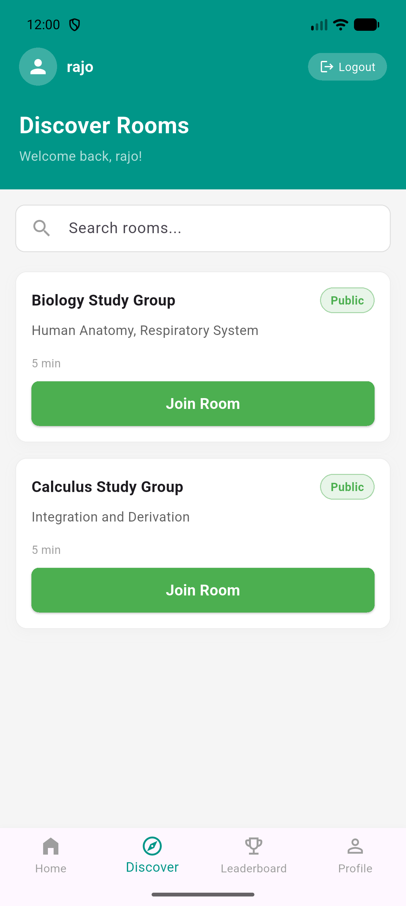

# Grouptalk # GroupTalk

GroupTalk is a Flutter-based study-room app that supports authentication, creating/joining study rooms, and an in-chat AI assistant. It uses Firebase for auth and Firestore for persistence, and an external AI endpoint for generated responses.

[](screenshots/my_room.png)
[](screenshots/discover_room.png)
[](screenshots/chat.png)

## Features

- Email/password authentication (register, login, logout)
- Create and join study rooms
- Real-time chat per room
- Optional AI assistant that generates short answers in chat
- Clean architecture (data / domain / presentation)

## Quick start

Prerequisites:

- Flutter SDK (stable)
- A Firebase project with Authentication and Firestore enabled
- Android/iOS tooling (emulator or device)

Setup:

1. Copy your Firebase config into the project (see `firebase_options.dart`)
2. Install dependencies:

```bash
flutter pub get
```

3. Run the app:

```bash
flutter run
```

## Firebase

This project expects Firebase to be configured using `flutterfire` and the generated `firebase_options.dart` in `lib/`.

- Auth: used for user registration and login
- Firestore: stores `users`, `rooms`, and `messages`

Files of interest:

- Core routing: [grouptalk/lib/core/core/Route/app_router.dart](grouptalk/lib/core/core/Route/app_router.dart)
- Auth BLoC: [grouptalk/lib/features/authentication/presentation/bloc/auth_bloc.dart](grouptalk/lib/features/authentication/presentation/bloc/auth_bloc.dart)
- Chat BLoC: [grouptalk/lib/features/chat/presentation/bloc/chat_bloc.dart](grouptalk/lib/features/chat/presentation/bloc/chat_bloc.dart)
- Chat UI: [grouptalk/lib/features/chat/presentation/screens/chat_page.dart](grouptalk/lib/features/chat/presentation/screens/chat_page.dart)
- AI data source: [grouptalk/lib/features/chat/data/datasources/ai_remote_data_source.dart](grouptalk/lib/features/chat/data/datasources/ai_remote_data_source.dart)

## AI Assistant

- The AI integration is implemented in `lib/features/chat/data/datasources/ai_remote_data_source.dart`.
- You must provide a valid API key for the chosen AI endpoint (the file currently contains a placeholder).
- The AI response is parsed and added to Firestore as a message by the chat repository.

## Architecture overview

The project follows a clean architecture split:

- `data/` — remote/local data sources and implementations
- `domain/` — entities, repositories interfaces, and usecases
- `presentation/` — BLoCs, UI screens and widgets

## How the AI request flows

1. UI dispatches `SendUserMessageEvent(requestAi: true)` when the AI toggle is enabled.
2. `ChatBloc` sends the user message via the repository.
3. `ChatBloc` reloads messages and emits `ChatLoaded` so the UI shows the user's message.
4. If `requestAi` is true, `ChatBloc` then requests an AI response, emits a `ChatSending(..., isAi: true)` state while waiting, and finally reloads messages with the generated AI reply appended.

## Common troubleshooting

- If the username is missing after registration, ensure `authStateChanges()` returns a model that includes `displayName` (see `lib/features/authentication/data/datasources/auth_remote_data_source.dart`).
- If AI fails, check the debug logs printed by `ai_remote_data_source.dart` (status code and response body) and confirm the API key / endpoint.

## Contributing

1. Fork the repo
2. Create a feature branch
3. Open a PR with tests and a clear description

## License

MIT

---

Screenshots

- Place your screenshots under `screenshots/` with the following filenames so the images render in this README:
	- `screenshots/my_rooms.png` — My Rooms screen
	- `screenshots/chat_ai.png` — Chat + AI screen

If you want, I can generate simple placeholder PNGs or update the README with inline base64 images. Replace the placeholder files with real screenshots to show them in GitHub.
